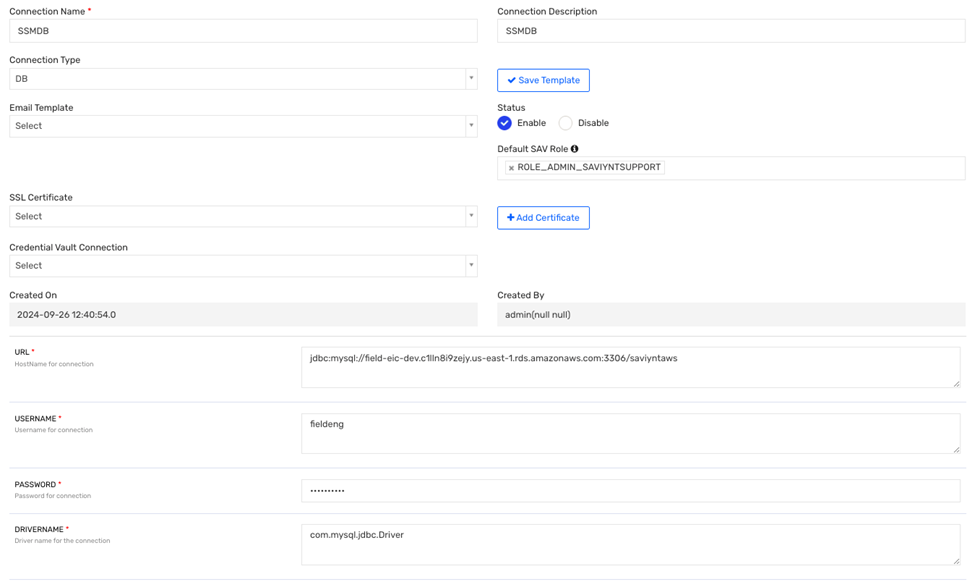

# Saviynt Database (DB) Connector

This **Saviynt DB Connector** enables integration with database applications to import accounts and entitlements into Saviynt’s Identity Governance platform. By leveraging this connector, organizations can map, import, and manage user data from databases, supporting identity governance and compliance requirements.

## Introduction

Saviynt Enterprise Identity Cloud (EIC) offers an out-of-the-box (OOB) capability to integrate database applications using a Saviynt DB connector. The platform provides OOB templates, which can be configured to support specific organizational requirements.

## How It Works

The DB Connector is configured to establish a secure connection between the source application database and Saviynt. This integration supports operations like data reconciliation and user provisioning, enabling synchronized and centralized identity management.

## Prerequisites

To ensure smooth connectivity and secure data transfer, the following prerequisites must be met:
- **Network Connectivity**: Verify that network connectivity is established and that firewall settings allow data flow between Saviynt and the EIC.
- **Whitelisting**: Ensure the target network and IP addresses are whitelisted.

## Integration Steps

Below are the basic steps for setting up the DB Connector:

1. **Create a Database Connection**:

	

   - **Connection Name**: Provide a descriptive name for the connection.
   - **Connection Type**: Select "DB" as the connection type to load the appropriate template.
   - **Database URL**: Specify the database hostname and schema.
   - **Username and Password**: Enter credentials for database access.
   - **Driver Name**: Select the database driver, e.g., `com.mysql.jdbc.Driver` for MySQL.
   
	

2. **Account Import Configuration**:
   - Use an XML file to map and import account data into Saviynt fields.
   - Example XML:
     ```xml
     <dataMapping>
       <before-import> </before-import>
       <sql-query description="Source DB Query" uniquecolumnsascommaseparated="name">
         <![CDATA[
         SELECT EmployeeID, EmailAddress, Entitlement, CAST(Status AS varchar) AS Status,
         AccountName AS ACCNAME, EndpointName, EndpointName AS SecuritySystem,
         CASE WHEN endpointname='Treasury Management System' THEN 'Groups' ELSE 'Role' END AS EntitlementType
         FROM DISCONNECTED_USERDATA WHERE endpointkey = 10
         ]]>
       </sql-query>
       <mapper description="Mapping fields for Saviynt" accountnotinfileaction="Suspend" deleteaccountentitlement="true" ifusernotexists="noaction" systems="'Treasury Management System'">
         <mapfield saviyntproperty="securitysystems.systemname" sourceproperty="SecuritySystem" type="character"/>
         <mapfield saviyntproperty="endpoints.endpointname" sourceproperty="EndpointName" type="character"/>
         <mapfield saviyntproperty="accounts.name" sourceproperty="ACCNAME" type="character"/>
         <mapfield saviyntproperty="accounts.customproperty1" sourceproperty="EmployeeID" type="character"/>
         <mapfield saviyntproperty="accounts.customproperty2" sourceproperty="EmailAddress" type="character"/>
         <mapfield saviyntproperty="entitlementtypes.entitlementname" sourceproperty="EntitlementType" type="character"/>
         <mapfield saviyntproperty="entitlementvalues.entitlementvalue" sourceproperty="Entitlement" type="character"/>
         <mapfield saviyntproperty="accounts.status" sourceproperty="Status" type="character"/>
       </mapper>
       <after-import description="EMAIL,BATCH,SQL"> </after-import>
     </dataMapping>
     ```

3. **Entitlement Import Configuration**:
   - Use an XML file to define entitlement and metadata import mapping.
   - Example XML:
     ```xml
     <dataMapping>
       <sql-query description="Source Database Query">
         <![CDATA[
         SELECT EmployeeID, description, EmailAddress, Entitlement, 1 AS Status,
         AccountName AS ACCNAME, EndpointName, EndpointName AS SecuritySystem,
         CASE WHEN endpointname='Treasury Management System' THEN 'Groups' ELSE 'Role' END AS EntitlementType
         FROM DISCONNECTED_USERDATA WHERE endpointname NOT IN ('Sudoer Review for AIX')
         ]]>
       </sql-query>
       <mapper description="Mapping fields for Saviynt" deleteentitlementowner="false" entnotpresentaction="inactive" createentitlementtype="true" systems="'Treasury Management System'">
         <mapfield saviyntproperty="securitysystems.systemname" sourceproperty="SecuritySystem" type="character"/>
         <mapfield saviyntproperty="endpoints.endpointname" sourceproperty="EndpointName" type="character"/>
         <mapfield saviyntproperty="entitlementtypes.entitlementname" sourceproperty="EntitlementType" type="character"/>
         <mapfield saviyntproperty="entitlementvalues.entitlement_value" sourceproperty="Entitlement" type="character"/>
         <mapfield saviyntproperty="entitlementvalues.entitlement_glossary" sourceproperty="description" type="character"/>
         <mapfield saviyntproperty="entitlementvalues.description" sourceproperty="description" type="character"/>
         <mapfield saviyntproperty="entitlementvalues.status" sourceproperty="Status" type="number"/>
       </mapper>
     </dataMapping>
     ```

## Data Mapping Structure

The **dataMapping** XML structure defines the import configuration:
- **<dataMapping>**: Main container for import settings.
- **<before-import>**: Placeholder for pre-import actions.
- **<sql-query>**: Defines the query to retrieve data from the source database.
  - **description**: Describes the query.
  - **uniquecolumnsascommaseparated**: Lists unique columns to identify records.
- **<mapper>**: Maps fields between the database and Saviynt.
  - **description**: Describes the mapping.
  - **accountnotinfileaction**: Action for accounts not in the source data.
  - **deleteaccountentitlement**: Deletes entitlements if the account is removed.
  - **systems**: Specifies endpoint systems involved.
- **<after-import>**: Specifies post-import actions (e.g., EMAIL, BATCH, SQL).

## Troubleshooting

Common errors include syntax issues in queries and data mismatches.

**Resolution**:
To troubleshoot, run the query directly in the target database and verify the result set to ensure accuracy.

---

This README provides an overview of setting up and configuring the Saviynt DB Connector, covering the main components, integration steps, data mapping, and troubleshooting tips.
